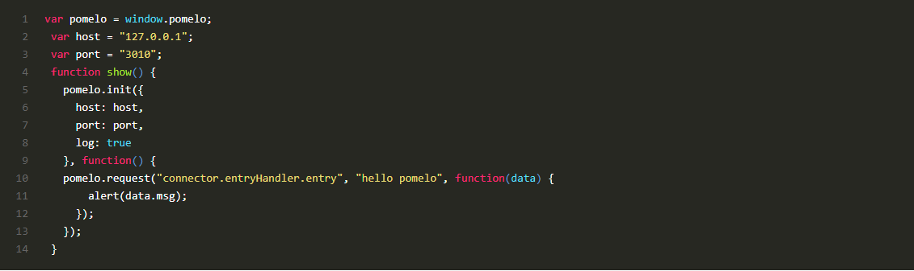

###客户端与服务端通信
####客户端编写
  以helloworld项目为例，打开`web-server/public/index.html`,可以看到如下代码：

客户端从发送request请求`connnecor.entryHandler.entry`,到服务端，在game-server目录找到`app/servers/connector/handler/entryHandler.js`,打开这个文件后可以发现了entry这个方法.

这样客户端就发消息到服务端啦。

next则是request请求完，服务端返回的结果,这里是通过回调实现的。
