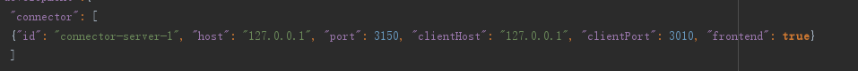
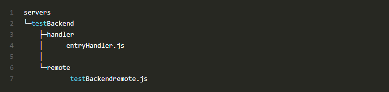

###请求与响应
Pomelo请求响应流程图：

在pomelo 请求响应模型中，它只有三层。

1.发起请求与响应的客户端。

2.接受，响应请求的Frontend。

3.处理Frontend 请求与响应的Backend。

来看一下Frontend 和Backend是做什么用的。

####Frontend（connector）
- 用于面向客户端的连接
- 维护Session信息
- 分发请求给Backend
- 推送消息给客户端
####Backend
- 处理来自于Frontend的请求
- 通过Channel 或者 Response 推送请求给frontend
- Rpc 服务

一般在Frontend服务器只做消息转发，不做处理，具体的逻辑在Backend服务器处理。

Pomelo 有一个特点就是通过对目录和命名约定来进行对组件的创建。所有关于frontend和backend的代码都在`game-server/app/servers/`目录下创建。

#####创建规则
- Frontend的创建

`第一级目录为servers Type，就是定义这个在服务端处于什么类型，例如，我们要创建一个gate 类型的服务用于负载均衡的话，我们只需要创建一个把connector 改为gate。
第二级目录约定为handler,所有处理请求的js文件都放在该目录下面。
entryHandler.js 这个文件为我们处理请求和响应的文件。`

这个connector对应着`game-server/config/servers.json`配置文件里的connector server。

Pomelo在启动的时候就会加载创建好的frontend。

- Backend的创建

`规则与frontend基本一致，不过多了一个remote目录，用于RPC的处理。然后，只需要在配置文件上面做相关配置，pomelo在启动的时候就会加载创建好的Backend。`

在配置文件里配置是否为frontend server。

如图，connector里面配置了`"frontend":true`,则connector为frontend server，而im没有配置，则默认为backend server。

接下来对`servers.json`配置文件里配置信息做一下说明：

- id 就是该server的在服务器的名字
- host 服务器的地址，用于frontend与backend之间连接
- port 服务器的端口号，用于frontend与backend之间连接
- clientPort 用于客户端连接的端口号
- clientPort 用于客户端连接的端口号
- frontend 是否是一个frontend
- max-connections 设置最大连接数