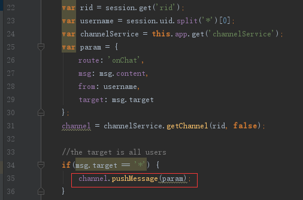
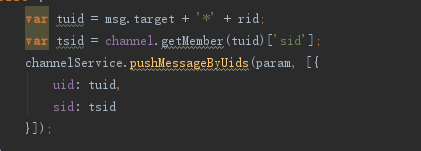

###rpc调用与channel广播
####rpc调用
rpc调用就是frontend将消息传给backend进行进一步复杂逻辑处理的过程。

这里以官方的`chatofpomelo`为例，在`game-server/app/servers/connnector/handler/entryHandler.js`的entry方法中，如图：

这里就是在进行rpc调用，这里pomelo有自己的一套路由规则，用于选择对应backend进行消息处理，我们还可以定义自己的路由规则。

在配置文件`servers.json`中可以看到chat类型的server有三个，如图：

pomelo的自定义路由是随机从三个server里面选择一个去处理frontend传过来的消息。

然后说说自定义路由，在`chatofpomelo`中就用了自定义路由。

在`game-server/app/util`目录下的`routeUtil.js`就是用来自定义路由的。如图：

在rpc调用时第一个参数session里面保存着进行选择backend server的信息，可以看到

`let res = dispatcher.dispatch(session.get('rid'), chatServers);`

 这里的`session.get('rid')`就是用rid来就行选择backend server的。 除此之外，还需要在`game-server/app.js`里面设置开启自定义路由，如图：

红色圈起来的部分就是设置开启自定义路由。

####channel广播
channel广播有两种形式，一种是通过channel名字给channel内发消息，另一种是不通过channel名字，而是通过session上绑定的uid和sid给指定的人发消息。
来看一下`chatofpomelo`中的例子，如图：

给channel内发消息：

给指定的人发消息：

